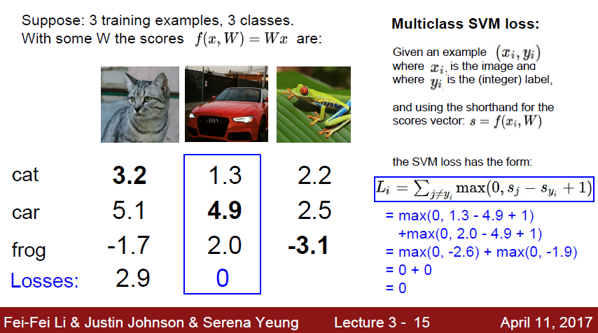
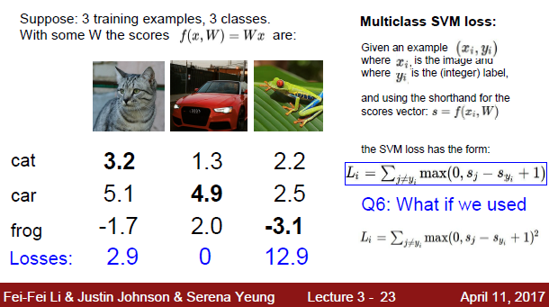

## cs231 Lecture 3

- Q1. 해당 슬라이드에서 Car score가 cat score보다 높아서 loss가 0이 됩니다. 그것은 무엇을 의미하는 것인가요?
- A1. SVM loss의 경우 max(0, s_j, s_yi+1)로 계산됩니다. s_yi가 정답 스코어입니다. 그래서 더 잘 예측할 수록(위의 슬라이드 기준으로 car score가 cat, frog score보다 더 높은 경우) s_j, s_yi+1는 음수를 가질 가능성이 더 커지겠죠. 여기서 1은 noise를 의미합니다(safety margin). 그래서 음수값을 가진다는 건 잘 분류했다는 뜻이고 loss는 max 공식에 의해 0을 갖게 됩니다.

 

- Q2. SVM loss function을 아래와 같이 제곱항으로 바꾸면 어떻게 될까요?
- A2. classifier가 얼마나 잘 하고 있는지 penalty를 주는 것이기 때문에, loss에 제곱을 하게 된다면 잘못 예측한 것(loss가 큰 경우)은 제곱만큼 loss가 커지게 됩니다.  따라서 square hinge loss는 잘못 분류되는 것을 절대 용납하지 못한다, 그냥 hinge loss는 잘못된 것과 조금 잘못된 것에 대해 크게 신경을 안 쓴다는 입장입니다. 그래서 결과는 달라집니다. 제곱을 해버리면 잘 예측한 것과 잘 예측하지 못한 것의 관계를 비선형적으로 바꾸기 때문입니다.(음숫값이 사라짐) loss function 계산 자체가 바뀌게 됩니다.